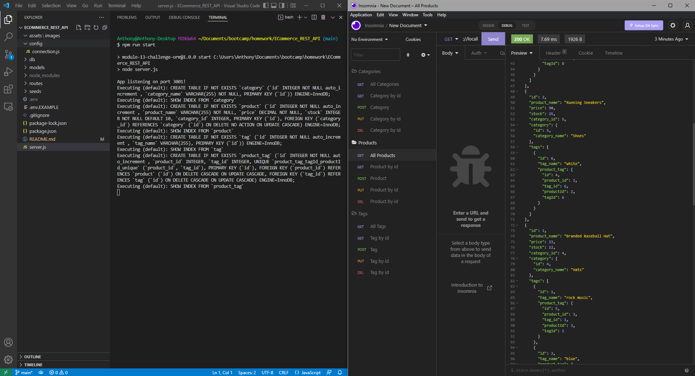

# ECommerce RESTful API

## Description

ECommerce based RESTful API that allows the user to GET/POST/PUT/DELETE information in a database using API requests or calls. The purpose of this project is to demonstrate the ability to send requests to a server and make active changes to a database using an API.

This project uses the following dependencies:
- [Node MySQL2](https://github.com/sidorares/node-mysql2#readme)
- [Sequelize](https://github.com/sequelize/sequelize#readme)
- [dotenv](https://github.com/motdotla/dotenv#readme)
- [Express](https://github.com/expressjs/express#readme)

## Table of Contents

1.  [Installation](#installation)

2.  [Usage](#usage)

3.  [License](#license)

4.  [Contributing](#contributing)

5.  [Tests](#tests)

6.  [Questions](#questions)

7.  [Finished Product](#finished-product)

---

## [Installation](#installation)

>## Step One
>Create a MySQL database
>
>Ensure that you have MySQL set up properly before anything else. If you are unfamiliar with MySQL, or setting it up, please take a moment to visit [this page](https://dev.mysql.com/doc/mysql-getting-started/en/) first.

>## Step Two
>Clone or Download
>
>You can clone the repo directly from github here, or you can download it as a a zip file. Just look for the green button at the top right corner of the gihub repo.

>## Step Three
>Navigate Terminal to Directory
>
>Once you have the ecommerce_rest_api directory on your computer, open up a terminal on its location.

>## Step Four
>Install Dependencies
>
>While you are located in the ecommerce_rest_api directory, enter 'npm install'. This should start installing all required dependencies.

>## Step Five
>Edit '.env.EXAMPLE' file
>
>You will need to edit the '.env.EXAMPLE' file to match the information of your MySQL database, such as:
>- host
>- user
>- password
>
>You will also nwant to update the file name itself to '.env' (removing the word EXAMPLE) so that it will actually get loaded in.
>All of these will need to be updated correctly for everything to work.

## [Usage](#usage)
<!-- Here you should enter how to use your project. You can use the outline below, or create one yourself -->
<!-- If you would like to have images in your how to, enclose them like so  -->

<!-- Make sure to have a '>' character before each new line -->
>## Step One
>Navigate Your Terminal
>
>Either open a new terminal or navigate your terminal on the location of the ecommerce_rest_api directory.

>## Step Two
>Set the Database
>
>While your terminal is located on the ecommerce_rest_api directory, enter 'npm run seed'. This will initialize the ecommerce database and some preset values (seeds).

>## Step Three
>Start the server
>
>In the same terminal, enter 'npm run start'. This will start the server and start logging all of the MySQL queries that Sequelize is attempting to execute

>## Step Four
>Send Requests
>
>If you have a HTTP-based API requesting tool like Insomnia or PostMan API, this will be a lot easier. Simply send requests to their correct routes including any information in the body as needed.
>
>If you don't have a tool for making API requests, then it is highly recommended you use one. You can sign-up for free and use [Post Man Here](https://www.postman.com/).

>## Other
>Here are a list of endpoints:
>- /api/categories/
>- /api/products/
>- /api/tags/
>
>Adding a number after the route will specify the id of what you are requesting, which is optional for GET requests, and manditory for PUT or DELETE requests. You cannot specify an id for the POST request.

---

## [License](#license)

 Copyright (c) 2022 Vidalatan Licensed under the MIT License license.

---

## [Contributing](#contributing)

Thank you for considering contributing to this project!

Following these contributing guidelines helps communicate that you respect the time of those who are managing and developing this open source project.
In return, you should recieve that same respect back in addressing your issue, assessing changes, and helping you finalize your pull requests.

There are many ways to contribute from documentation, tutorials, social media, but reports, feature requests or submitting your own code. Please feel 
encouraged to assist in any way applicable to your skills!

---

## [Tests](#tests)

Demonstration of starting the server and some quick requests for Categories:

Demonstration of all Category requests:

Demonstration of all Product requests:

Demonstration of all Tag requests:

## [Questions](#questions)

 Questions regarding this project should be directed towards @Vidalatan at vidalatan@gmail.com

## [Finished Product](#finished_product)

Link to [Code Repository](https://github.com/Vidalatan/ECommerce_REST_API/#readme)

